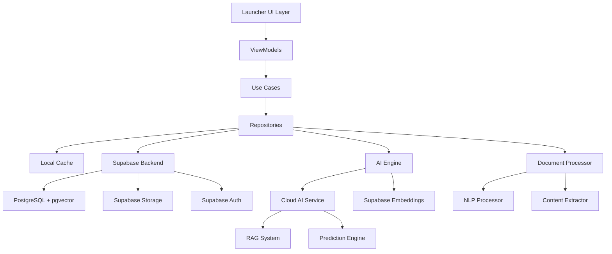

# Design Document

## Overview

The routine-based launcher is an AI-powered Android launcher that uses Retrieval-Augmented Generation (RAG) and spatial embedding analysis to anticipate user needs and generate contextual UI. The system operates on a foundation of routine-based contexts (morning, afternoon, evening, weekend) with user-defined actions and intentions, creating a predictive and adaptive user experience.

The launcher leverages cloud-based machine learning models and natural language processing for heavy AI operations, while maintaining local storage for behavioral patterns and user data. This hybrid approach enables sophisticated AI capabilities for the MVP while ensuring responsive user experience through local caching and offline fallbacks.

## Architecture

### High-Level Architecture



### Core Components

1. **AI Engine**: Central intelligence system managing RAG, embeddings, and predictions
2. **Document Processor**: Handles document upload, analysis, and intention extraction
3. **Routine Manager**: Manages routine contexts and automatic switching
4. **Behavior Tracker**: Records and analyzes user interaction patterns
5. **UI Generator**: Creates contextual interfaces based on predictions
6. **Supabase Repository**: Handles data persistence and vector operations using Supabase
7. **Local Cache**: Room database for offline functionality and performance

## Components and Interfaces

### 1. AI Engine Module

#### Cloud AI Service
```kotlin
interface CloudAIService {
    suspend fun generatePredictions(request: PredictionRequest): PredictionResponse
    suspend fun processDocument(document: DocumentInput): DocumentAnalysis
    suspend fun createEmbeddings(content: List<String>): EmbeddingResponse
    suspend fun analyzeUserBehavior(patterns: List<BehaviorPattern>): BehaviorAnalysis
}

data class PredictionRequest(
    val userContext: UserContext,
    val behaviorHistory: List<UserAction>,
    val activeIntentions: List<Intention>
)

data class PredictionResponse(
    val predictions: List<ActionPrediction>,
    val confidence: Float,
    val reasoning: String
)

#### RAG System
```kotlin
interface RAGSystem {
    suspend fun queryKnowledgeBase(context: UserContext): List<RelevantPattern>
    suspend fun addBehaviorPattern(pattern: BehaviorPattern)
    suspend fun updateEmbeddings(userAction: UserAction)
    suspend fun generatePredictions(context: UserContext): List<ActionPrediction>
}

data class UserContext(
    val currentRoutine: RoutineType,
    val timeOfDay: LocalTime,
    val recentActions: List<UserAction>,
    val activeIntentions: List<Intention>,
    val locationContext: LocationContext? = null
)

data class ActionPrediction(
    val action: String,
    val confidence: Float,
    val associatedApps: List<AppInfo>,
    val reasoning: String,
    val priority: Int
)
```

#### Supabase Repository
```kotlin
interface SupabaseRepository {
    suspend fun saveRoutine(routine: Routine): Result<Unit>
    suspend fun getRoutines(userId: String): Result<List<Routine>>
    suspend fun saveUserAction(action: UserAction): Result<Unit>
    suspend fun getBehaviorPatterns(userId: String, timeRange: TimeRange): Result<List<BehaviorPattern>>
    suspend fun saveDocument(document: DocumentInput): Result<String>
    suspend fun searchSimilarPatterns(embedding: FloatArray, threshold: Float): Result<List<SimilarPattern>>
    suspend fun saveEmbedding(embedding: VectorEntry): Result<Unit>
}

#### Embedding Engine
```kotlin
interface EmbeddingEngine {
    suspend fun createActionEmbedding(action: UserAction): FloatArray
    suspend fun createIntentionEmbedding(intention: Intention): FloatArray
    suspend fun findSimilarPatterns(embedding: FloatArray, threshold: Float): List<SimilarPattern>
    suspend fun updateVectorDatabase(embedding: FloatArray, metadata: EmbeddingMetadata)
}

data class SimilarPattern(
    val pattern: BehaviorPattern,
    val similarity: Float,
    val context: UserContext
)
```

### 2. Document Processing Module

#### Document Processor
```kotlin
interface DocumentProcessor {
    suspend fun processDocument(document: DocumentInput): DocumentAnalysis
    suspend fun extractIntentions(analysis: DocumentAnalysis): List<Intention>
    suspend fun generateActionPlan(intentions: List<Intention>): ActionPlan
    suspend fun updateRoutinesFromDocument(actionPlan: ActionPlan)
}

data class DocumentInput(
    val content: ByteArray,
    val fileName: String,
    val mimeType: String,
    val uploadTimestamp: Instant
)

data class DocumentAnalysis(
    val extractedText: String,
    val keyThemes: List<String>,
    val identifiedGoals: List<String>,
    val suggestedActions: List<String>,
    val timelineElements: List<TimelineElement>,
    val documentType: DocumentType
)

enum class DocumentType {
    PROJECT_REQUIREMENTS,
    STUDY_MATERIAL,
    RELIGIOUS_TEXT,
    PERSONAL_GUIDE,
    REFERENCE_DOCUMENT,
    UNKNOWN
}
```

#### NLP Processor
```kotlin
interface NLPProcessor {
    suspend fun extractEntities(text: String): List<NamedEntity>
    suspend fun identifyIntentions(text: String): List<ExtractedIntention>
    suspend fun generateSummary(text: String): String
    suspend fun classifyDocumentType(text: String): DocumentType
}

data class ExtractedIntention(
    val description: String,
    val confidence: Float,
    val suggestedRoutine: RoutineType,
    val associatedActions: List<String>,
    val timeframe: String?
)
```

### 3. Routine Management Module

#### Routine Manager
```kotlin
interface RoutineManager {
    suspend fun getCurrentRoutine(): Routine
    suspend fun switchRoutine(routineType: RoutineType, isManual: Boolean = false)
    suspend fun updateRoutineIntentions(routineType: RoutineType, intentions: List<Intention>)
    suspend fun getActiveIntentions(): List<Intention>
    fun observeRoutineChanges(): Flow<Routine>
}

data class Routine(
    val id: String,
    val name: String,
    val type: RoutineType,
    val startTime: LocalTime,
    val endTime: LocalTime,
    val intentions: List<Intention>,
    val actions: List<RoutineAction>,
    val isActive: Boolean = true,
    val priority: Int = 0
)

data class Intention(
    val id: String,
    val description: String,
    val priority: Int,
    val sourceDocument: String? = null,
    val targetActions: List<String>,
    val successMetrics: List<String>,
    val isActive: Boolean = true
)
```

### 4. Behavior Tracking Module

#### Behavior Tracker
```kotlin
interface BehaviorTracker {
    suspend fun recordUserAction(action: UserAction)
    suspend fun recordAppLaunch(appInfo: AppInfo, context: UserContext)
    suspend fun recordUIInteraction(interaction: UIInteraction)
    suspend fun getBehaviorPatterns(timeRange: TimeRange): List<BehaviorPattern>
    suspend fun analyzeUserFlow(actions: List<UserAction>): FlowAnalysis
}

data class UserAction(
    val id: String,
    val type: ActionType,
    val timestamp: Instant,
    val context: UserContext,
    val appInfo: AppInfo? = null,
    val outcome: ActionOutcome? = null,
    val duration: Duration? = null
)

data class BehaviorPattern(
    val id: String,
    val sequence: List<ActionType>,
    val frequency: Int,
    val successRate: Float,
    val contextFactors: List<String>,
    val embedding: FloatArray
)
```

### 5. UI Generation Module

#### UI Generator
```kotlin
interface UIGenerator {
    suspend fun generateLauncherUI(predictions: List<ActionPrediction>): LauncherUIState
    suspend fun generateWidgetLayout(context: UserContext): List<WidgetConfig>
    suspend fun adaptUIForPredictions(currentUI: LauncherUIState, newPredictions: List<ActionPrediction>): LauncherUIState
}

data class LauncherUIState(
    val primaryActions: List<ActionCard>,
    val secondaryActions: List<ActionCard>,
    val widgets: List<WidgetConfig>,
    val layout: LayoutConfig,
    val theme: ThemeConfig
)

data class ActionCard(
    val action: String,
    val apps: List<AppInfo>,
    val confidence: Float,
    val quickActions: List<QuickAction>,
    val visualPriority: Int
)
```

## Data Models

### Core Data Models

#### Local Database Schema (Room)
```kotlin
@Entity(tableName = "routines")
data class RoutineEntity(
    @PrimaryKey val id: String,
    val name: String,
    val type: String,
    val startTime: String,
    val endTime: String,
    val isActive: Boolean,
    val priority: Int,
    val createdAt: Long,
    val updatedAt: Long
)

@Entity(tableName = "intentions")
data class IntentionEntity(
    @PrimaryKey val id: String,
    val routineId: String,
    val description: String,
    val priority: Int,
    val sourceDocument: String?,
    val targetActions: String, // JSON array
    val successMetrics: String, // JSON array
    val isActive: Boolean,
    val createdAt: Long
)

@Entity(tableName = "user_actions")
data class UserActionEntity(
    @PrimaryKey val id: String,
    val type: String,
    val timestamp: Long,
    val routineId: String,
    val appPackageName: String?,
    val contextData: String, // JSON
    val outcome: String?,
    val duration: Long?
)

@Entity(tableName = "behavior_patterns")
data class BehaviorPatternEntity(
    @PrimaryKey val id: String,
    val sequence: String, // JSON array
    val frequency: Int,
    val successRate: Float,
    val contextFactors: String, // JSON array
    val embedding: String, // Base64 encoded FloatArray
    val lastUpdated: Long
)

@Entity(tableName = "documents")
data class DocumentEntity(
    @PrimaryKey val id: String,
    val fileName: String,
    val mimeType: String,
    val content: String,
    val analysis: String, // JSON
    val uploadTimestamp: Long,
    val isActive: Boolean
)
```

#### Supabase Database Schema
```sql
-- Routines table
CREATE TABLE routines (
    id UUID PRIMARY KEY DEFAULT gen_random_uuid(),
    user_id UUID REFERENCES auth.users(id),
    name TEXT NOT NULL,
    type TEXT NOT NULL,
    start_time TIME NOT NULL,
    end_time TIME NOT NULL,
    is_active BOOLEAN DEFAULT true,
    priority INTEGER DEFAULT 0,
    created_at TIMESTAMP WITH TIME ZONE DEFAULT NOW(),
    updated_at TIMESTAMP WITH TIME ZONE DEFAULT NOW()
);

-- Intentions table
CREATE TABLE intentions (
    id UUID PRIMARY KEY DEFAULT gen_random_uuid(),
    routine_id UUID REFERENCES routines(id),
    user_id UUID REFERENCES auth.users(id),
    description TEXT NOT NULL,
    priority INTEGER DEFAULT 0,
    source_document TEXT,
    target_actions JSONB,
    success_metrics JSONB,
    is_active BOOLEAN DEFAULT true,
    created_at TIMESTAMP WITH TIME ZONE DEFAULT NOW()
);

-- User actions table
CREATE TABLE user_actions (
    id UUID PRIMARY KEY DEFAULT gen_random_uuid(),
    user_id UUID REFERENCES auth.users(id),
    type TEXT NOT NULL,
    timestamp TIMESTAMP WITH TIME ZONE DEFAULT NOW(),
    routine_id UUID REFERENCES routines(id),
    app_package_name TEXT,
    context_data JSONB,
    outcome TEXT,
    duration INTERVAL
);

-- Behavior patterns table with vector embeddings
CREATE TABLE behavior_patterns (
    id UUID PRIMARY KEY DEFAULT gen_random_uuid(),
    user_id UUID REFERENCES auth.users(id),
    sequence JSONB NOT NULL,
    frequency INTEGER DEFAULT 1,
    success_rate REAL DEFAULT 0.0,
    context_factors JSONB,
    embedding VECTOR(1536), -- OpenAI embedding dimension
    last_updated TIMESTAMP WITH TIME ZONE DEFAULT NOW()
);

-- Documents table
CREATE TABLE documents (
    id UUID PRIMARY KEY DEFAULT gen_random_uuid(),
    user_id UUID REFERENCES auth.users(id),
    file_name TEXT NOT NULL,
    mime_type TEXT NOT NULL,
    storage_path TEXT NOT NULL,
    analysis JSONB,
    upload_timestamp TIMESTAMP WITH TIME ZONE DEFAULT NOW(),
    is_active BOOLEAN DEFAULT true
);

-- Enable pgvector extension for similarity search
CREATE EXTENSION IF NOT EXISTS vector;

-- Create indexes for performance
CREATE INDEX idx_behavior_patterns_embedding ON behavior_patterns USING ivfflat (embedding vector_cosine_ops);
CREATE INDEX idx_user_actions_user_timestamp ON user_actions(user_id, timestamp);
CREATE INDEX idx_routines_user_active ON routines(user_id, is_active);
```

#### Kotlin Data Models for Supabase
```kotlin
@Serializable
data class SupabaseRoutine(
    val id: String,
    val userId: String,
    val name: String,
    val type: String,
    val startTime: String,
    val endTime: String,
    val isActive: Boolean = true,
    val priority: Int = 0,
    val createdAt: String,
    val updatedAt: String
)

@Serializable
data class SupabaseIntention(
    val id: String,
    val routineId: String,
    val userId: String,
    val description: String,
    val priority: Int = 0,
    val sourceDocument: String? = null,
    val targetActions: List<String>,
    val successMetrics: List<String>,
    val isActive: Boolean = true,
    val createdAt: String
)

@Serializable
data class SupabaseBehaviorPattern(
    val id: String,
    val userId: String,
    val sequence: List<String>,
    val frequency: Int,
    val successRate: Float,
    val contextFactors: List<String>,
    val embedding: List<Float>, // Vector as List<Float> for JSON serialization
    val lastUpdated: String
)
```

### Machine Learning Models

#### Local ML Model Configuration
```kotlin
data class MLModelConfig(
    val modelType: ModelType,
    val modelPath: String,
    val inputDimensions: IntArray,
    val outputDimensions: IntArray,
    val confidenceThreshold: Float,
    val lastTrainingTimestamp: Long
)

enum class ModelType {
    ACTION_PREDICTION,
    INTENTION_CLASSIFICATION,
    DOCUMENT_ANALYSIS,
    BEHAVIOR_CLUSTERING,
    UI_OPTIMIZATION
}
```

## Error Handling

### Error Types and Handling Strategies

#### AI Engine Errors
```kotlin
sealed class AIEngineError : Exception() {
    object ModelNotLoaded : AIEngineError()
    object InsufficientData : AIEngineError()
    data class PredictionFailed(val reason: String) : AIEngineError()
    data class EmbeddingGenerationFailed(val cause: Throwable) : AIEngineError()
}

class AIErrorHandler {
    suspend fun handlePredictionError(error: AIEngineError): FallbackStrategy {
        return when (error) {
            is AIEngineError.ModelNotLoaded -> FallbackStrategy.UseDefaultPredictions
            is AIEngineError.InsufficientData -> FallbackStrategy.CollectMoreData
            is AIEngineError.PredictionFailed -> FallbackStrategy.UseLastKnownGood
            is AIEngineError.EmbeddingGenerationFailed -> FallbackStrategy.SkipEmbedding
        }
    }
}
```

#### Document Processing Errors
```kotlin
sealed class DocumentProcessingError : Exception() {
    object UnsupportedFormat : DocumentProcessingError()
    object ContentExtractionFailed : DocumentProcessingError()
    data class NLPProcessingFailed(val stage: String) : DocumentProcessingError()
    object IntentionExtractionFailed : DocumentProcessingError()
}
```

#### Graceful Degradation
- When AI predictions fail, fall back to usage-based recommendations
- When document processing fails, allow manual intention setting
- When embeddings fail, use simple keyword matching
- When models are unavailable, use rule-based predictions

## Testing Strategy

### Unit Testing
- **AI Engine Components**: Mock ML models and test prediction logic
- **Document Processor**: Test with sample documents of various types
- **Behavior Tracker**: Test pattern recognition and storage
- **UI Generator**: Test UI state generation from predictions

### Integration Testing
- **End-to-End Prediction Flow**: From user action to UI update
- **Document-to-Intention Pipeline**: Full document processing workflow
- **Routine Switching**: Automatic and manual routine changes
- **Data Persistence**: Local storage and retrieval accuracy

### Performance Testing
- **ML Model Inference Time**: Ensure predictions complete within 500ms
- **Embedding Generation**: Test with large behavior datasets
- **UI Generation Speed**: Measure time from prediction to UI update
- **Memory Usage**: Monitor ML model memory consumption

### Privacy Testing
- **Data Isolation**: Verify no data leaves the device
- **Secure Storage**: Test encryption of sensitive behavioral data
- **Data Deletion**: Verify complete removal of user data
- **Model Privacy**: Ensure embeddings don't expose raw data

### User Experience Testing
- **Prediction Accuracy**: Measure prediction success rates over time
- **UI Responsiveness**: Test UI adaptation speed and smoothness
- **Learning Effectiveness**: Verify system improves with usage
- **Fallback Behavior**: Test graceful degradation scenarios

## Implementation Dependencies

### Required Libraries
```kotlin
// Supabase
implementation("io.github.jan-tennert.supabase:postgrest-kt:2.6.0")
implementation("io.github.jan-tennert.supabase:storage-kt:2.6.0")
implementation("io.github.jan-tennert.supabase:gotrue-kt:2.6.0")
implementation("io.github.jan-tennert.supabase:realtime-kt:2.6.0")

// Cloud AI Services
implementation("com.squareup.retrofit2:retrofit:2.9.0")
implementation("com.squareup.retrofit2:converter-gson:2.9.0")
implementation("com.squareup.okhttp3:logging-interceptor:4.12.0")

// Local Database (for caching)
implementation("androidx.room:room-runtime:2.6.1")
implementation("androidx.room:room-ktx:2.6.1")
kapt("androidx.room:room-compiler:2.6.1")

// Coroutines and Flow
implementation("org.jetbrains.kotlinx:kotlinx-coroutines-android:1.7.3")

// JSON Processing
implementation("org.jetbrains.kotlinx:kotlinx-serialization-json:1.6.2")

// File Processing
implementation("com.github.barteksc:android-pdf-viewer:3.2.0-beta.1")

// Basic Text Processing (for offline fallbacks)
implementation("org.apache.tika:tika-core:2.9.1")
```

### Android Permissions
```xml
<uses-permission android:name="android.permission.QUERY_ALL_PACKAGES" />
<uses-permission android:name="android.permission.READ_EXTERNAL_STORAGE" />
<uses-permission android:name="android.permission.ACCESS_COARSE_LOCATION" />
<uses-permission android:name="android.permission.RECEIVE_BOOT_COMPLETED" />
```

### Launcher Configuration
```xml
<activity
    android:name=".launcher.LauncherActivity"
    android:exported="true"
    android:launchMode="singleTask"
    android:stateNotNeeded="true"
    android:theme="@style/Theme.Launcher">
    <intent-filter android:priority="1">
        <action android:name="android.intent.action.MAIN" />
        <category android:name="android.intent.category.HOME" />
        <category android:name="android.intent.category.DEFAULT" />
    </intent-filter>
</activity>
```

#### Network and Cloud Service Errors
```kotlin
sealed class NetworkError : Exception() {
    object NoInternetConnection : NetworkError()
    object CloudServiceUnavailable : NetworkError()
    data class APIRateLimitExceeded(val retryAfter: Long) : NetworkError()
    data class CloudProcessingTimeout(val operation: String) : NetworkError()
}

class NetworkErrorHandler {
    suspend fun handleNetworkError(error: NetworkError): FallbackStrategy {
        return when (error) {
            is NetworkError.NoInternetConnection -> FallbackStrategy.UseOfflineMode
            is NetworkError.CloudServiceUnavailable -> FallbackStrategy.UseLocalCache
            is NetworkError.APIRateLimitExceeded -> FallbackStrategy.DelayAndRetry(error.retryAfter)
            is NetworkError.CloudProcessingTimeout -> FallbackStrategy.UseSimplifiedProcessing
        }
    }
}
```

## Security and Privacy Considerations

### Data Protection for MVP
- User behavioral data anonymized before cloud transmission
- Document content encrypted during cloud processing
- Local storage encrypted using Android Keystore
- Cloud API communications secured with TLS 1.3
- User consent required for cloud processing of sensitive documents

### Cloud Service Security
- API keys stored securely using Android Keystore
- Request/response data encrypted in transit
- Cloud processing logs automatically purged after 24 hours
- User data not used for model training without explicit consent
- Fallback to local processing when cloud services unavailable

### Privacy Controls
- User can opt-out of cloud processing for specific document types
- Local-only mode available for privacy-sensitive users
- Data retention policies clearly communicated to users
- Regular cleanup of cached cloud responses
- Secure deletion of uploaded document content after processing

### Offline Capabilities
- Core launcher functionality works without internet connection
- Local caching of recent predictions and UI states
- Basic pattern recognition using local algorithms
- Graceful degradation when cloud services unavailable

This design provides a comprehensive foundation for building an AI-powered launcher MVP that leverages cloud capabilities while maintaining user privacy and providing reliable offline functionality.